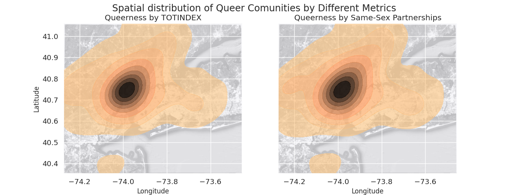
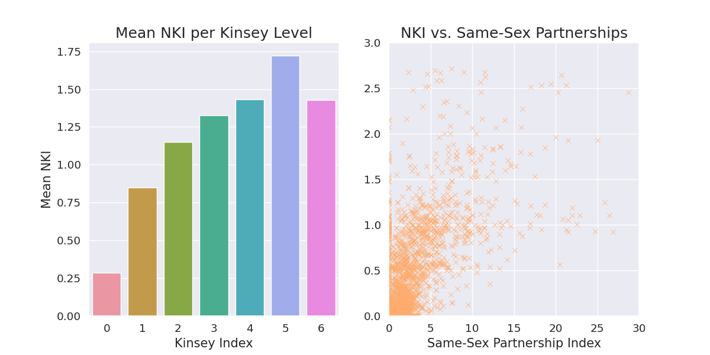
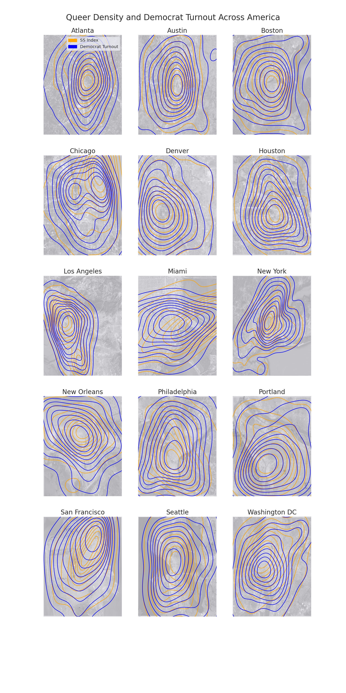

## Introduction

## Exploratory Data Analysis

## Do queer communities concentrate in space?
The objective of this research question is to determine if queer communities are geographically concentrated. More specifically, we wanted to determine if a community with a high population of gay and lesbian residents is likely to be surrounded by communities with a similarly-sized population of gay and lesbian residents. This can be broken down more quantitatively by asking the following: for a neighbourhood measurably queer to some degree, how queer are the adjacent neighbourhoods on average?

## Quantitatively measuring queerness
At several points during this analysis, we will refer to a given neighbourhood's "queerness" as though it's a single, continuous, quantitative variable. We do this for convenience and to more effectively work within the constraints of the data we have available, although it's worth admitting and discussing what this means and it's limitations. It should be obvious that how we quantitatively measure the queerness of a space is subjective, and the decisions we make in this analysis can be problematic.

To begin, we must acknowledge the role statisticians have played presently and historically in systematically eliminating minorities. One local example of this is the way that Canada's Indian Act works to incrementally strip Indigenous people of their legal recognition of being Indigenous through the malitiously-named process of "enfranchisement"[^1], in a process many now refer to as "statistical genocide." Discretely categorizing people enables oppression and marginalizes deviation. That second issue is particularly pertinent in the case of the queer community, which is predicated on "bending rules," so to speak. For that reason, we are hesitant to use the phrase "queer community," as it implicitly makes the assumption that the constituents of the so-called "queer community" have a universal experience, which is untrue.

Jan Diehm admits the following in "Men are from Chelsea, Women are from Park Slope"[^2] [^3].

> Currently, there’s no comprehensive way to quantitatively measure gayborhoods, or even where LGBTQ Americans live. Most of the existing data sticks to a narrow view (i.e. traditional marriage, the male/female gender binary) of the queer spectrum and “rainbow-washes” any intersectionality of race, ethnicity, class, gender, and sexuality. This project aims to paint a slightly more complete picture, combining several metrics to create a gayborhood index, but even then it admittedly underweights and undercounts areas with non-binary and minority populations. Still, this is some of the most complete data that we have.

This dataset fails to represent queerness outside the context of monogamous partnerships between cisgender people (or at least, those who have been statistically represented as such). For this reason, we seek to be very upfront that we are only exploring so-called "same-sex" partnerships.

The individuals who worked on the article attempted to mitigate some of these issues by drawing from a variety of sources to measure the queerness of a given neighbourhood, including whether or not a pride parade travels through the neighbourhood or the number of bars tagged as "gay" on Yelp in the area. In our study of the concentration of queer communities and their political inclinations, we decided to ignore all factors that don't involve the number of gay and/or lesbian residents in the neighbourhood.

The above graph illustrates a topological graph of gaybouhoods in New York City shaded darker by two metrics of queerness: "TOTINDEX" being the composite index and the latter representing only the number of gay and lesbian residents. While the graphs are visually distinct, the distinction is relatively minor. Nonetheless, we proceed using the latter as a key symbolic decision.

To facilitate the discussion of queerness in space in the first two research questions, we introduce an additional index that discretely classifies neighbourhoods into 7 categories labeled `0` through `6`, with zero indicating a region has the fewest relative gay/lesbian residents and 6 indicating that the region has relatively the most gay/lesbian residents. The choice to divide the dataframe into seven categories was arbitrary, although inspired by Alfred Kinsey's research into the fluidity of human sexuality[^4]. Similarly to the Kinsey scale, the relationship will be linear.

Besides the Kinsey index of a given observation, we are also interested in the kinsey index of observations adjacent to a given neighbourhood. This, we refer to as the observation's "neighbourhood kinsey index," or NKI, where our usage of the word "neighbourhood" is borrowed from graph theory, in referring to the set of all vertices connected by an edge to a given vertex. This measurement is calculated algorithmically by sampling a small set of observations geographically near each neighbourhood. A full implementation of this algorithm can be found [here](./analysis/code/project_functions1.py).

### Quantitatively representing queer concentration

The first graph illustrates the mean neighbourhood kinsey index of all observations for each kinsey index, and as such, the height of each graph represents how queer adjacent neighbourhoods of a given neighbourhood will be on average. Notably, in general, the neighbourhoods adjacent to a given relatively queer neighbourhood are not on average more queer than the given neighbourhood. This is not particularly surprising when we consider the fact that queer people form a minority of the general population. However, on average, the more queer a given neighbourhood is, the more queer its adjacent neighbourhoods will be on average across the United States. This provides some evidence that queer communities tend to concentrate in space.

The second graph compares the mean neighbourhood kinsey index of each observation to its same-sex index, revealing that the same trend is present, although there is a substantial amount of variation. Similar to the first graph, we see that this trend becomes less representative for neighbourhoods with a higher kinsey index. This makes sense when we consider that observations forming the geographical peak will necessarily be surrounded by neighbourhoods of a lower kinsey index.

### Topographically illustrating queer concentration

The previous 15 graphs topographically represent the concentration of queer communities in 15 cities across the United States. Regions shaded darker contain more queer residents per neighbourhood. In all 15 cities studied, we see a relatively sharp "peak" in gay residents in one area. Further, neighbourhoods tend to get less queer radially outwards of this peak. Another interesting observation is that with the exception of Chicago and Miami, all of the queerest communities in each city tend to be clustered around the geographical city centre. This is in line with conventional wisdom that the inner-city tends to be inhabited primarily by poor people and other marginalized groups, while the more privileged groups tend to live outside the city, commuting in for work. The exceptionality of Chicago and Miami could be due to unique city planning.

Although the overarching trend remains, there are some inherent limitations to using topological graphs to illustrate this data. These limitations are explored further in our [complete analysis](analysis/analysis1.ipynb).

To briefly summarize: our research is consistent with the notion that queer communities tend to concentrate in space, and this trend appears to be consistent in cities across the United States.

## How do queer communities lean politically?

In the second research question, we sought to determine the relationship between the concentration of gay and lesbian residents in a neighbourhood and the percentage of the neighbourhood's county who voted democrat in the 2012 American presidential election. From this, we hope to gleam insight into how living in a highly queer neighbourhood influences residents' political alignment.

This analysis is limited by the fact that the smallest spatial unit in American presidential elections is the county, and the gaybourhood data set observations are positioned spatially by coordinates. We solved this problem by using the geographic coordinates of the counties represented in the gaybourhoods dataset to calculate the nearest county to each gaybourhood observation. This algorithm works similar to how we calculated the average Kinsey index about a given neighbourhood, and its complete implementation can again be found [here](./analysis/code/project_functions1.py).

![Bar graph of democrat vote share by Kinsey index)(analysis/images/graphs/15-kinsey-democrat-plot.png)

Using the tools discussed in the previous section, it is immediately apparent that on average, neighbourhoods across the country that have a higher Kinsey index tend to vote more democrat, although, similar to last time, this trend becomes less apparent for neighbourhoods with a higher concentration of queer people. There's a number of factors that could influence this. As shown in the previous section, neighbourhoods with a higher Kinsey index tend to have less spread across the city, and when we factor in gerrymandering, it's possible these regions are more likely to be unfairly drawn into a county with fewer Democratic voters.

To take a closer look on the city-level, we can use the same approach as last time to visualize the two phenomena topographically:

When we illustrate the density of queerness and democrat votership, we see that in seven of the cities, the peaks completely overlap. In the vast majority of the cities studied, the peaks mostly overlap. Only in the case of Miami do the peaks seem to not overlap. This exception is likely due to the fact that here, our usage of this type of graph is misleading, because most of the region covered by the gaybourhoods dataset is contained within a single county.

Through both our numerical and spatial research, the results consistently show that neighbourhoods with a higher number of queer residents tend to vote more democrat.

## Conclusion

Over the last semester, we have analyzed data from numerous sources to find answers to four geographic questions about the queer community. Firstly, we wanted to understand whether or not queer communities tend to concentrate in space, and found that neighbourhoods with a higher density of gay and lesbian residents tend to be close to other neighbourhoods with a higher density, clustering in city centers, such that there's typically a geographical peak in queerness around the middle of each city. We used similar methods of analysis to study the political alignment of residents of queer neighbourhoods and found that across the country, neighbourhoods with more queer people tend to vote more democrat. Thirdly, we asked if there was a meaningful difference in the amount of money queer people pay in taxes versus non-queer people, and found that in general, suburban queer people tend to pay higher taxes. Finally [RQ4], and learned [RQ4 CONCLUSION].

In a world increasingly dominanted by data-driven decision-making, minority communities, being already underrepresented, are particularly at risk of being further marginalized. While there are numerious risks associated with collecting and publishing data on these groups, it is equally important to ensure queer people are present and included. Answering questions about social issues regarding the queer community is greatly complicated by the fact that we are systematically excluded from the discussion, and considerably more effort is necessary to eliminate the systematic bias disabling queer representation.

## Footnotes

[^1]: Source: <https://www.cbc.ca/radio/unreserved/how-the-indian-act-continues-to-impact-the-lives-of-first-nation-people-1.5614187>

[^2]: Source: <https://pudding.cool/2018/06/gayborhoods/>

[^3]: The title of this in and of itself makes a very clear statement about how unrepresentative their project is.

[^4]: The Kinsey scale is a seven point scale measuring a person's attraction to people of the same sex. For further reading, see: <https://en.wikipedia.org/wiki/Kinsey_scale>